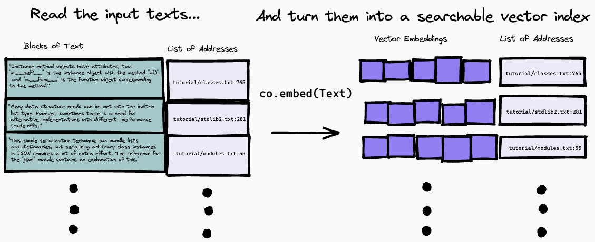
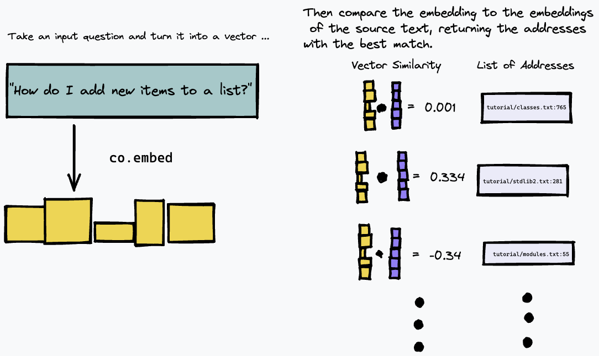

```
################################################################################
#    ____      _                     ____                  _ _                 #
#   / ___|___ | |__   ___ _ __ ___  / ___|  __ _ _ __   __| | |__   _____  __  #
#  | |   / _ \| '_ \ / _ \ '__/ _ \ \___ \ / _` | '_ \ / _` | '_ \ / _ \ \/ /  #
#  | |__| (_) | | | |  __/ | |  __/  ___) | (_| | | | | (_| | |_) | (_) >  <   #
#   \____\___/|_| |_|\___|_|  \___| |____/ \__,_|_| |_|\__,_|_.__/ \___/_/\_\  #
#                                                                              #
# This project is part of Cohere Sandbox, Cohere's Experimental Open Source    #
# offering. This project provides a library, tooling, or demo making use of    #
# the Cohere Platform. You should expect (self-)documented, high quality code  #
# but be warned that this is EXPERIMENTAL. Therefore, also expect rough edges, #
# non-backwards compatible changes, or potential changes in functionality as   #
# the library, tool, or demo evolves. Please consider referencing a specific   #
# git commit or version if depending upon the project in any mission-critical  #
# code as part of your own projects.                                           #
#                                                                              #
# Please don't hesitate to raise issues or submit pull requests, and thanks    #
# for checking out this project!                                               #
#                                                                              #
################################################################################
```

**Maintainer:** [jcudit](https://github.com/jcudit) and [lsgos](https://github.com/lsgos) \
**Project maintained until at least (YYYY-MM-DD):** 2023-03-14

# Toy Semantic Search

This is an example of how to use the Cohere API to build a simple semantic search engine. It is not meant to be 
production-ready or scale efficiently (although could be adapted to these ends), but rather serves to showcase the
ease of producing a search engine powered by representations produced by Cohere's Large Language Models (LLMs).

The search algorithm used here is fairly simple: it simply finds the paragraph which most closely matches the 
representation of the question, using the `co.embed` endpoint.
This is explained in more detail below, but here is a simple diagram of what's going on.
First we break down the input text into a series of paragraphs, storing their addresses in the input into a list and generating a vector embedding for each paragraph using `co.embed`:



Then, we can query our index by embedding the text query, and finding the paragraphs in the source text which have the closest match using some measure of vector similarity (we used the cosine similarity):



As a result, it works best on text sources where the answer to a given question is likely to be given by a 
concrete paragraph in the text, like technical documentation or internal wiki's which are structured as a list of 
concrete  instructions or facts. It doesn't work nearly so well at, for example, answering questions about freeform 
text like novels where the information might be spread over several paragraphs; you would need to use a different method of indexing the text for this.

# Usage

As an example, this repository builds a simple semantic search engine over the text version of the latest python 
documentation.

## Setup 

To install python requirements, ensure you have [poetry installed](https://python-poetry.org/docs/#installation) and run:
```sh
# install python deps
poetry install
```

You should also have [docker](https://www.docker.com/) installed. On OS X, if you use homebrew, we recommend running
```sh
brew install --cask docker
```
Before running docker (e.g. to run our server) for the first time on OS X, open the Docker app and grant it the
privileges it needs to run on your system.

You will also need to have a Cohere API Key in the `COHERE_TOKEN`. Get one from 
[the Cohere platform](https://dashboard.cohere.ai/) (create an account if needed), and write it to your environment
```bash
export COHERE_TOKEN=<MY_API_KEY>
```
(where `<MY_API_KEY>` is the key you obtained, without the `<...>` brackets).

Alternatively, you can pass `COHERE_TOKEN=<MY_API_KEY>` as an additional argument to any `make` command below.

## Building an index

Follow these steps to first build a semantic index of your document collection. These steps produce a semantic index for
the official python docs, but could be adapted for arbitary data collections.

### Step 1: Get some text
First, download the python documentaton by running one of the following commands.

If you want to get started quickly, run
```bash
make download-python-docs-small
```
to limit the document set to the python tutorial. **We only recommend doing this for a quick test, as the results
will be very limited**.

If you want to test the search engine over the entire python documentation, run
```bash
make download-python-docs
```
but be aware that producing the embeddings will take **hours** (although this only needs to be done once).

Alternatively if you want to experiment with your own text, then simply download it as `.txt` files to a directory 
called `txt/` in this repository.

### Step 2: Process the text into a index of embeddings (representations)
Once you have some text, we need to process it into a search index of embeddings and addresses. 

This can be done by using the command 
```bash
make embeddings
``` 
assuming your target text is under the `./txt/` directory. 

The command will search the `./txt/` directory recursively for files with a `.txt` extension, and build a simple 
database of the embeddings, file name and line number of each paragraph. 

**Warning: If you have a lot of text to search, this can take a little while to finish!**

### Step 3: Build and launch the search engine

Once you have an `embeddings.npz` file built, you can use the following command to build a docker image which will 
serve a simple REST app to allow you to query the database you have made:
```bash
make build
``` 

You can then start the server using 
```bash
make run
```

This is slightly overkill for a simple example, but it's designed to reflect the fact that building an index of a large 
body of text is relatively slow, and ensures that querying the engine is fast.

If you want to use this project as a building block for a real application, it is likely that you will want to maintain 
your database of text embeddings in a server architecture and query it with a lightweight client. Packaging the server 
as a docker application means that it is very simple to turn this into a 'real' application by deploying it to a cloud 
service.

### Step 4: Query your search engine

If you open a new terminal window for any of the options below, remember to run
```bash
export COHERE_TOKEN=<MY_API_KEY>
```

#### **Via a viewer script**

By far the easiest option is to run our helper script:
```sh
scripts/ask.sh "My query here"
```
to query the database. The script takes an optional second argument specifying the number of desired results.

The script pops up a modified vim interface, with the following commands:
* Press `q` to quit.
* Press the UP or LEFT arrow to page up in the list of results (show in the bottom pane)
* Press the DOWN or RIGHT arrow to page down in the list of results

The top pane will show you the position in the document where the result is found.

#### **Via a REST API**

Once the server is running, you can query it using a simple REST api. You can explore the API directly by going to 
`/docs#/default/search_search_post` [here](http://localhost:8080/docs#/default/search_search_post).
It's a simple JSON REST API; here's how you can ask a query using `curl`:

```
curl -X POST -H "Content-Type: application/json" -d '{"query": "How do I append to a list?", "num_results": 3}' http://localhost:8080/search
```

This will return a JSON list of length `num_results`, each with the filename and line-number 
(`doc_url` and `block_url`) of the blocks that were the closest semantic match to your query.
But you probably want to actually just read the bit of the files that's the best answer. 

#### **Via vim**

As we are searching through local text files, it's actually a bit easier to parse the output using command 
line tools; use the provided python script `utils/query_server.py` to query it on the command line.
`query_server.py` prints out the results in the standard `file_name:line_number:` format, so we can page through the 
actual results in a nice way be leveraging `vim`'s quickfix mode.

Assuming you have vim on your machine, you can simply
```
vim +cw -M -q <(python utils/query_server.py "my_query" --num_results 3)
```
to get vim to open the indexed text files at the locations returned by the search algorithm. (use `:qall` to close both 
the window and the quickfix navigator). You can cycle through the returned results using `:cn` and `:cp`.
The results aren't perfect; it's semantic search, so you would expect the matching to be a bit fuzzy. Despite this, I often find you 
can get the answer to your question in the first few results, and using cohere's API lets you express your 
question in natural language, and let's you build a suprisingly effective search engine in just a few lines of code.

### Example queries

Some good-to-try queries in the python docs case that show the search working well on generic, natural language questions are:
- `How do I put new items in a list?` (Note that this question avoids using the keyword 'append', and doesn't exactly match how the docs explain append (they 
say it's used to _add_ new items to the end of a list). But the semantic search correctly figures out that the relevant 
paragraph is still the best match.)
- `How do I put things in a list?`
- `Are dictionary keys in insertion order?`
- `What is the difference between a tuple and a list?` (notice for this question, that the first result for me is an FAQ about basically this exact topic, but with a 
 differently worded question. However, since it's semantic search, our algorithm correctly picks out a result that 
 matches the meaning, not just the wording, of our query)
- `How do I remove an item from a set?`
- `How do list comprehensions work?`


### Algorithm Details

This repo uses a very simple strategy to index a document, and search for the best match. First, it breaks up every 
document into paragraphs, or 'blocks'.
Then, it calls `co.embed` on each paragraph, in order to generate a vector embedding using Cohere's language model.
It then stores each embedding vector, along with the corresponding document and line number of the paragraph, in a 
simple array as a 'database'. 

In order to actually do the search, we use the [FAISS](https://github.com/facebookresearch/faiss) similarity search 
library.
When we get a query, we use the same Cohere API call to embed the query. We then use FAISS to find the top $n$ results 
closest to the query, as measured by the [cosine similarity](https://en.wikipedia.org/wiki/Cosine_similarity) between 
their vector embeddings.
This is more or less the most basic possible setup for similarity search using an embedding model. Some ways that you 
may want to think about improving it, if you are building on this example, are 
- using different search algorithms. This is mostly relevant if your dataset is particularly large, which might make 
exact search too slow. It would be simple to adapt this code to use some of the approximate search algorithms in FAISS, 
which can give sublinear scaling in the dataset size at the cost of not always returning the exact closest match to a 
given query vector.
- Changing the embedding. The approach here, of simply embedding the paragraphs and the queries with the same model, 
seems to work pretty well! But there are some potentially interesting ways to experiment with how to do both of these. 
TODO : reference the question generation in nicks contextual google bot. 

# Get support
If you have any questions or comments, please file an issue or reach out to us on [Discord](https://discord.gg/co-mmunity).

# Contributors
If you would like to contribute to this project, please read `CONTRIBUTORS.md`
in this repository, and sign the Contributor License Agreement before submitting any pull requests. A link to sign the
Cohere CLA will be generated the first time you make a pull request to a Cohere repository.

# License
Toy Semantic Search has an MIT license, as found in the LICENSE file.
